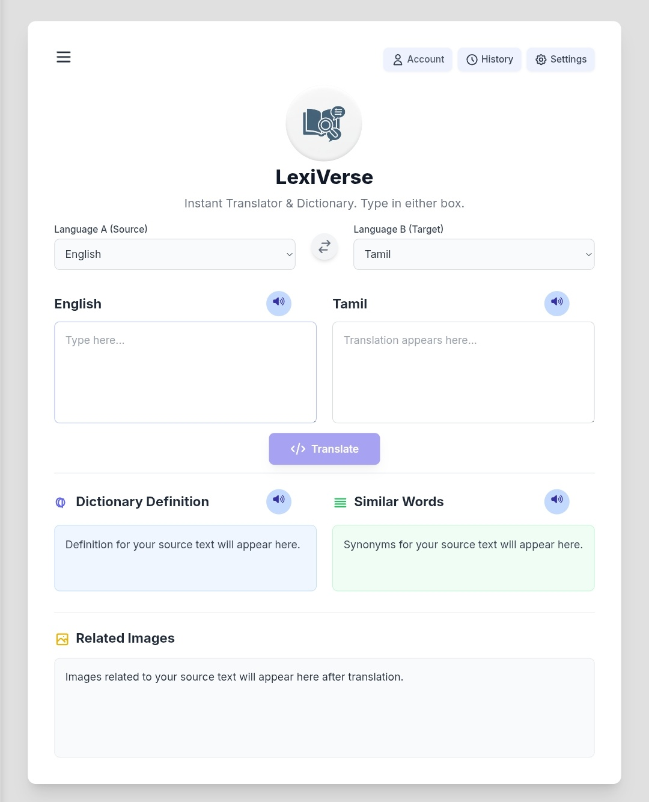

<div align="center">


# LexiVerse

### *Instant Translator & Dictionary — Speak Every Language*

[](https://your-demo-link.com)
[](https://your-demo-link.com)
[](https://your-username.github.io/lexi-verse)
[](https://github.com/manikandan-n-07)

</div>

---

## Table of Contents

- [What is LexiVerse?](#what-is-lexiverse)
- [Preview](#preview)
- [Features](#features)
- [Tech Stack](#tech-stack)
- [Project Structure](#project-structure)
- [Setup and Deployment](#setup-and-deployment)
- [How to Use](#how-to-use)
- [Supported Languages](#supported-languages)
- [Security Notes](#security-notes)
- [Contributing](#contributing)
- [Acknowledgements](#acknowledgements)
- [Author](#author)

---

## What is LexiVerse?

**LexiVerse** is a sleek, feature-rich web application that combines real-time **language translation**, **dictionary definitions**, **synonym discovery**, and **visual image search** — all in one beautiful interface. Powered by AI and designed as a Progressive Web App (PWA), it works seamlessly on both desktop and mobile devices, even offline.

> *"Breaking language barriers, one word at a time."*

---

## Preview


---

## Features

| Feature | Description |
|---|---|
| 🔤 **Instant Translation** | Translate text across **150+ languages** powered by a secure AI backend |
| 📖 **Dictionary Definitions** | Get rich, formatted definitions for the words you translate |
| 🔁 **Synonym Discovery** | Explore similar words and synonyms presented as interactive chips |
| 🖼️ **Related Image Search** | Visual context via the Pexels API — see images related to your source text |
| 🔊 **Text-to-Speech** | Listen to translations, definitions, and synonyms using native browser voices |
| 🌙 **Dark Mode** | Toggle between light and dark themes, with preferences saved locally |
| 🕐 **Translation History** | Full session and cloud-backed history with sorting by date |
| 👤 **User Accounts** | Sign up / log in with Gmail — history synced to the cloud via Google Sheets |
| 📱 **PWA (Installable)** | Install LexiVerse on your phone or desktop and use it like a native app |
| ✉️ **Contact Form** | Built-in validated contact form with real-time submission feedback |

---

## Tech Stack

```
Frontend         →  HTML5 · CSS3 · Vanilla JavaScript · Tailwind CSS
Icons            →  Font Awesome 6
Fonts            →  Google Fonts (Inter)
Translation AI   →  Gemini API (via secure Google Apps Script proxy)
Image Search     →  Pexels API (via secure Google Apps Script proxy)
Auth & History   →  Google Apps Script + Google Sheets (serverless backend)
Deployment       →  GitHub Pages
PWA              →  Service Worker · Web App Manifest
```

---

## Project Structure

```
lexi-verse/
│
├── index.html              # Main application HTML
├── manifest.json           # PWA manifest configuration
├── sw.js                   # Service Worker for offline support
│
├── script/
│   └── script.js           # Core application logic
│
├── style/
│   └── style.css           # Custom styles and dark mode
│
├── src/
│   └── img/
│       └── logotranslator.png   # App logo
│
└── .github/
    └── workflows/
        └── static.yml      # GitHub Pages deployment workflow
```

---

## Setup and Deployment

### Prerequisites

- A Google account (for the Apps Script backend)
- A [Pexels API key](https://www.pexels.com/api/) (free)
- A [Google Gemini API key](https://aistudio.google.com/) (free tier available)

### 1. Clone the Repository

```bash
git clone https://github.com/manikandan-n-07/lexi-verse.git
cd lexi-verse
```

### 2. Configure the Backend (Google Apps Script)

The app uses **three** Google Apps Script deployments as a secure proxy layer:

| Variable | Purpose |
|---|---|
| `PROXY_URL` | Handles Gemini translation + Pexels image search |
| `AUTH_HISTORY_URL` | Manages user sign-up, login, and cloud history |
| `TRANSLATION_LOGGER_URL` | Logs translations server-side |

1. Open [script.google.com](https://script.google.com) and create your Apps Script projects.
2. Deploy each one as a **Web App** (access: Anyone).
3. Copy the deployed URLs into `script/script.js`:

```javascript
const PROXY_URL = "YOUR_PROXY_APPSCRIPT_URL_HERE";
const AUTH_HISTORY_URL = "YOUR_AUTH_HISTORY_APPSCRIPT_URL_HERE";
const TRANSLATION_LOGGER_URL = "YOUR_TRANSLATION_LOGGER_APPSCRIPT_URL_HERE";
```

### 3. Deploy to GitHub Pages

Push the project to your GitHub repository. The included `.github/workflows/static.yml` workflow will automatically deploy to GitHub Pages on every push to `main`.

```bash
git add .
git commit -m "Initial deployment"
git push origin main
```

Your app will be live at:
```
https://manikandan-n-07.github.io/lexi-verse
```

---

## How to Use

1. **Select languages** from the two language dropdowns (Source → Target).
2. **Type your text** in either input box.
3. Press **Translate** (or hit `Enter`) to get:
   - The translation in the opposite box
   - A dictionary definition
   - Synonyms / similar words
   - Related images from Pexels
4. Click the **🔊 speaker icon** to hear any text read aloud.
5. **Create an account** to save your translation history to the cloud.
6. Open **Settings** to switch Dark Mode or change the TTS voice.
7. **Install the app** using your browser's "Add to Home Screen" option for a native-like experience.

---

## Supported Languages

LexiVerse supports over **150 languages**, including:

`English` · `Tamil` · `Hindi` · `Spanish` · `French` · `German` · `Japanese` · `Korean` · `Arabic` · `Portuguese` · `Russian` · `Chinese (Simplified)` · `Chinese (Traditional)` · `Bengali` · `Telugu` · `Marathi` · `Urdu` · `Swahili` · `Zulu` · `and 130+ more…`

---

## Security Notes

- API keys are **never exposed** in the frontend — all API calls are routed through a secure Google Apps Script proxy.
- Passwords are handled server-side via Google Sheets (consider upgrading to a production auth service for sensitive deployments).
- DevTools access is restricted in production to protect the source.

---

## Contributing

Contributions are welcome! Here's how to get started:

```bash
# 1. Fork the repository
# 2. Create a feature branch
git checkout -b feature/your-feature-name

# 3. Commit your changes
git commit -m "Add: your feature description"

# 4. Push and open a Pull Request
git push origin feature/your-feature-name
```

Please ensure your code follows the existing style and that any new features are documented.

---

## Acknowledgements

- [Pexels](https://www.pexels.com/) — Beautiful free stock photos & videos
- [Google Gemini](https://deepmind.google/technologies/gemini/) — AI translation backbone
- [Tailwind CSS](https://tailwindcss.com/) — Utility-first CSS framework
- [Font Awesome](https://fontawesome.com/) — Icon library
- [Google Fonts](https://fonts.google.com/) — Inter typeface

---

## Author

<div align="center">

### Manikandan N

*Full Stack Developer & Creator of LexiVerse*

[](https://github.com/manikandan-n-07)
[](https://www.linkedin.com/in/manikandan-n-35a1bb294)
[](mailto:maniluna07@gmail.com)

</div>

---

<div align="center">

Made with ❤️ by **Manikandan N**

⭐ **If you found this useful, please give it a star!** ⭐

</div>
